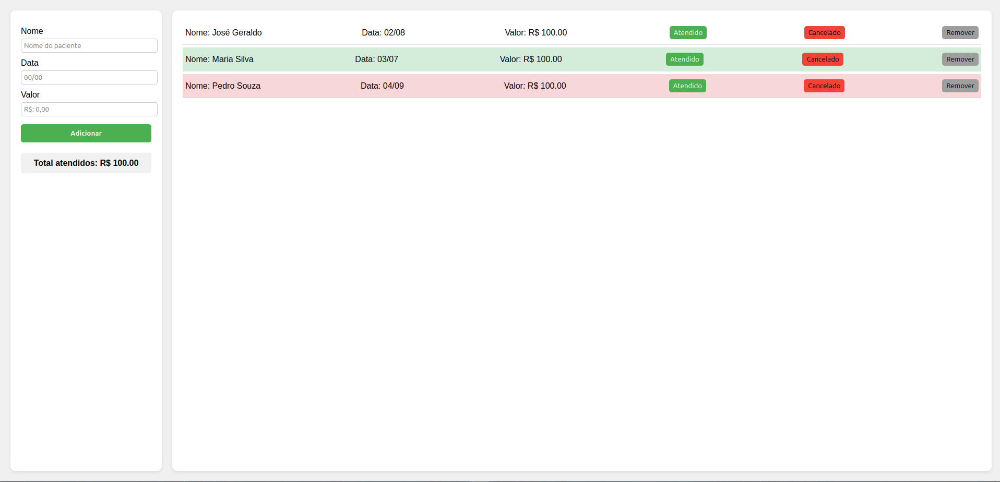

## Agenda de Contatos

Uma aplicação simples de Agenda, permitindo cadastrar, visualizar, editar e excluir contatos.

A aplicação também faz o calculo dos agendamentos marcados como atendido.

Projeto criado para treinar JavaScript, lógica de programação, manipulação de DOM e organização de código.

